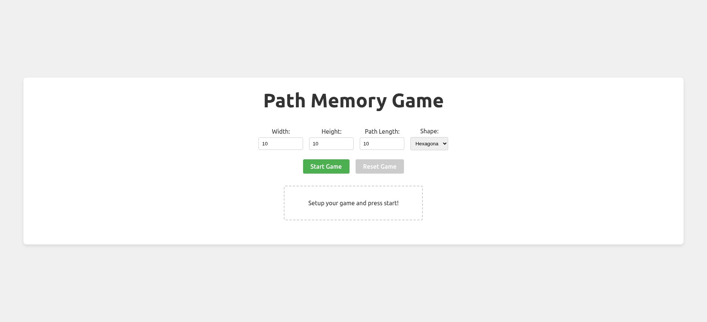
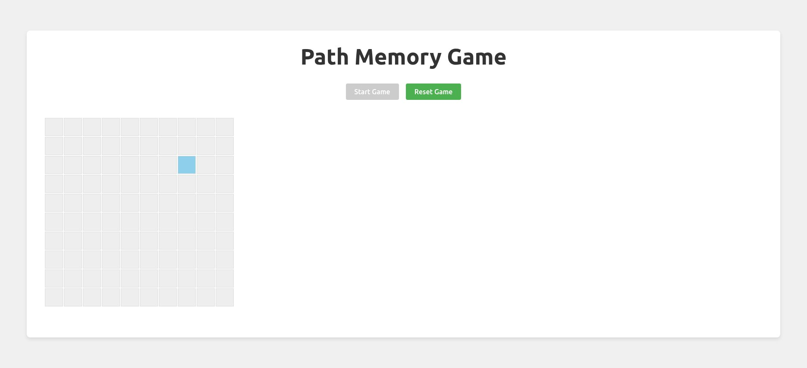
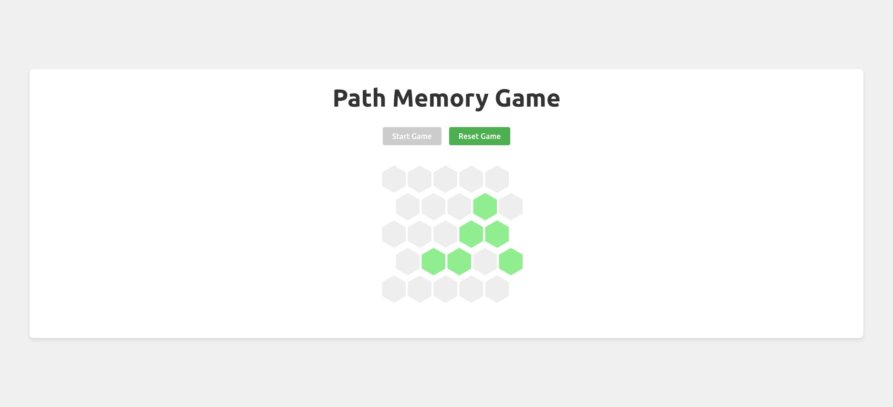
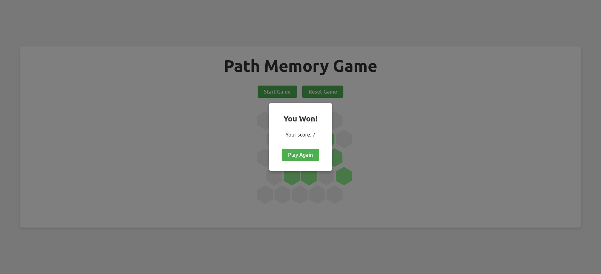

# README

This is a game created during a vibecoding contest at an interactive [ScaDS.AI Meetup](https://scads.ai/event/meetup/) "Vibe Coding Contest | Mini-Hackathon" on December 11, 2025.

[Firebase studio](https://studio.firebase.google.com) with gemini 3 was used.

## Images






## local setup

```bash
nix develop
npm install
npm run dev
```
